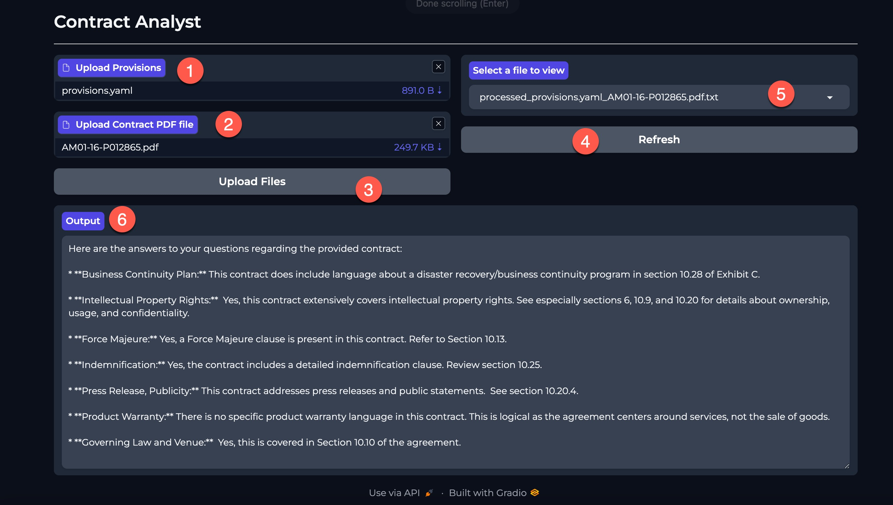

  
# Contract Analyst

## Configuration 
```bash
 pip install -r frontend/requirements.txt
 pip install -r backend/requirements.txt
 export BUCKET_NAME=<yourbucketname>
 export PROJECT_ID=<yourprojectname>
```
The app can be configured to send all provisions and questions to once or one at a time.
```bash
# set up to send all provisions and questions to model at once
export BULK_ANSWER="Y"
# set up to send one provisions and questions to model at a time
export BULK_ANSWER="N"
```
You can also update .env file and run ```load_env-variables.py``` to load all environment varaibles. 

## Run Frontend Gradio Application
```bash
cd frontent
gradio app.py
```
## Run Backend Application
Change model name of your choice in backend/gemini.py
```python 
MODEL_ID = "gemini-1.5-pro" 
```
Run the backend application
```bash
cd backend
python app.py
```


